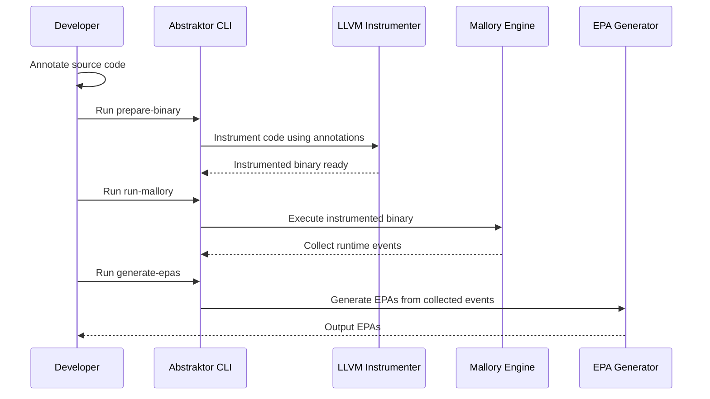

# abstraktor
[](https://github.com/matias-gonz/abstraktor/actions/workflows/test.yml) [](https://codecov.io/gh/matias-gonz/abstraktor)

**Abstraktor** is a tool designed to assist in the validation of distributed protocol implementations by automatically generating enabling-preserving abstractions (EPAs). Unlike existing tools that only detect runtime errors, **Abstraktor** aims to uncover issues in the business logic of implementations.

The solution is based on four main components:

1. **Instrumenter**: Processes the source code of the target application to generate an executable that exposes its internal state.  
2. **Mallory Extension**: A fork of the Mallory tool that performs efficient fuzzing while also extracting the internal state of the instrumented executable.  
3. **EPA Generator**: Builds and exports EPAs using the state data collected during fuzzing.  
4. **CLI Tool**: Coordinates and orchestrates the interaction between all components to produce the final abstractions.

## Installation

To install Abstraktor, you need to have Rust and Cargo installed on your system. If you haven't installed them yet, you can follow the instructions on the [official Rust website](https://www.rust-lang.org/tools/install).

Once you have Rust and Cargo installed, you can clone the repository and build the project:

```
cargo build
```

## Running tests

Run tests using:

```
cargo test
```

## Workflow



### Description

1. **Annotate Source Code**: Manually add comments to relevant parts of your application logic to mark key points for analysis.  
2. **prepare-binary**: Instruments the source code using LLVM based on the provided annotations.  
3. **run-mallory**: Executes the instrumented binary under Mallory to simulate network conditions and collect runtime events.  
4. **generate-epas**: Processes the collected data to automatically construct enabling-preserving abstractions (EPAs).
